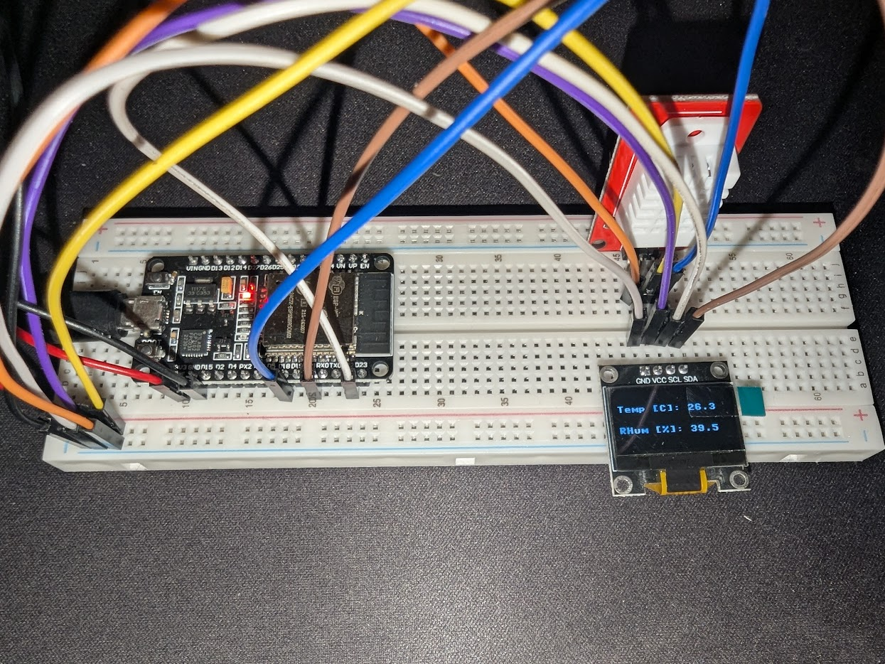

# Temperature- and Humidity Sensor

A simple temperature- and humidity sensor using:
- ESP32 DEVKIT V1
- AM2302 DHT22 Digital Temperature & Humidity Sensor Module
- TENSTAR 0.96 Inch OLED SSD1306


## Breadboard Schematics


## Setup

- IDE: VSCode with [Pymakr](https://marketplace.visualstudio.com/items?itemName=pycom.Pymakr)
- Firmware: [Micropython ESP32 Generic](https://micropython.org/download/ESP32_GENERIC/) (Flashed with `esptool`)
- Python Virtualenv for stubs:
```bash
python3 -m venv .venv
. .venv/bin/activate
pip install -r requirements.txt
```